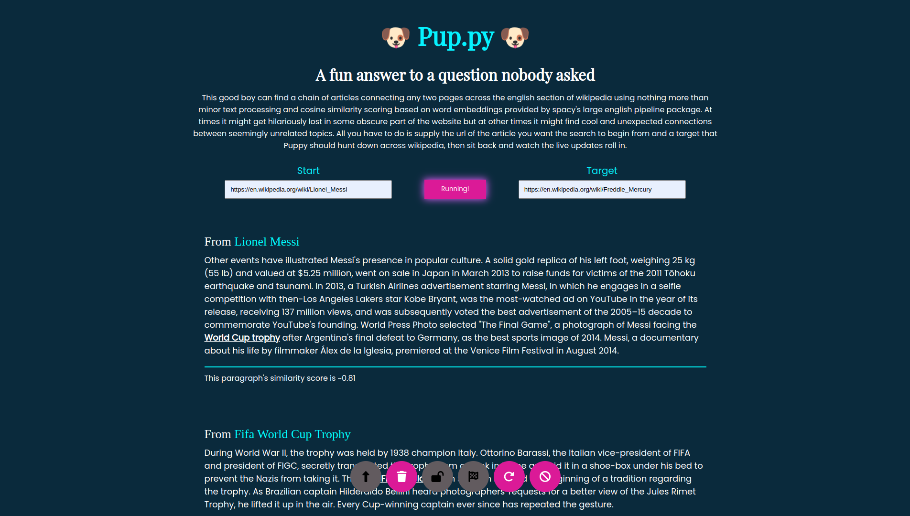

# 🐶 pup.py 🐶

This good boy can find a chain of articles connecting any two pages across the english section of wikipedia using nothing more than minor text processing and [cosine similarity](https://spacy.io/usage/linguistic-features#vectors-similarity) scoring based on word embeddings provided by spacy's large english pipeline package. At times it might get hilariously lost in some obscure part of the website but at other times it might find cool and unexpected connections between seemingly unrelated topics. All you have to do is supply the url of the article you want the search to begin from and a target that Puppy should hunt down across wikipedia, then sit back and watch the live updates roll in.

Note: This is a work in progress and is still missing many features, so you might run into bugs. Feel free to open an issue to report any problems with the app or even fix them yourself through a pull request.

------------------

In order to get the project set up and ready `cd` into the webapp folder and run `npm i` followed by `npm run build`, this will ensure that the front end of the app will be bundled and ready to be served by the flask server. Now `cd` back to the root of the project and run `python -m venv puppy_env` to keep things tidy and then run `pip install -r requirements.txt`. At this point puppy is ready to go, simply run `python server.py` and visit the web address logged by flask in the console, enjoy!

